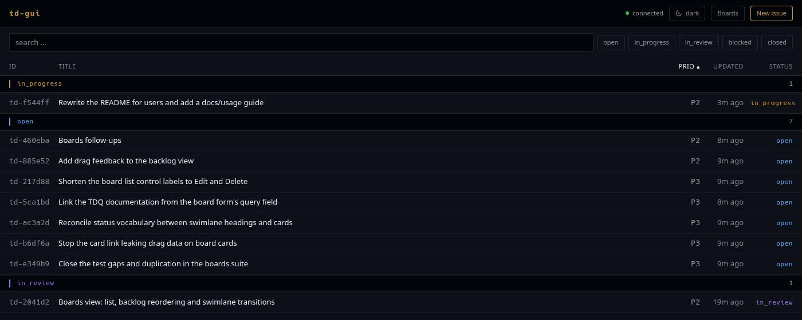

# td-gui

A local web UI for [td](https://github.com/marcus/td) — the issue tracker
built for sessions that forget, where agents and humans hand work off to each
other through handoffs and reviews.

td-gui puts that backlog in a browser. It runs on your machine, talks to td's
own HTTP API, and shows exactly what the CLI would: the same issues, the same
review policy, the same wording when td says no.



## What you can do with it

- **Read the backlog at a glance.** Issues are grouped by status in attention
  order — what is moving first, what is done last — and sort by id, title,
  priority or last update. Filter by status, search the text.
- **Open an issue and see everything td knows.** Description, acceptance
  criteria, the latest handoff split into done / remaining / decisions /
  uncertain, the activity log, comments, dependencies, the review standing on
  it, and which sessions touched it.
- **Move work along.** Start, request review, approve, reject, block, unblock,
  close, reopen — with a reason where td records one. Only the transitions td
  reports as available are offered.
- **Review the way td expects.** Approving asks how the review is attributed:
  done independently, done by someone else, or self-reviewed. You can also
  record a review without closing the issue.
- **Create and edit issues.** Type, priority, points, sprint, labels with
  autocomplete, parent, due date, defer date, the minor flag.
- **Work from boards.** Any saved TDQ query, as a flat backlog you can pin and
  reorder, or as swimlanes where dragging a card proposes a status change.
- **Watch it update itself.** When an agent writes from the CLI in another
  terminal, the page follows along — no reload.

Light and dark theme, keyboard-reachable controls, one binary, nothing leaves
`127.0.0.1`.

## Quick start

Grab a binary from the
[latest release](https://github.com/madic-creates/td-gui/releases/latest)
(`td-gui-vX.Y.Z-linux-amd64`, with a `.sha256` next to it), or build it
yourself with `make build`. Then, inside a td project:

```bash
td-gui
```

It picks a free port, starts (or reuses) `td serve`, and opens your browser.

```bash
td-gui --port 7777        # fixed port
td-gui --no-open          # do not open a browser
td-gui --work-dir ../other-project
td-gui --td /path/to/td   # use a specific td binary
td-gui --version          # released binaries print their tag, local builds "dev"
```

**Requirements:** `td` **v0.57.0** or newer on your PATH, and a directory that
has already been through `td init`. td-gui never runs `td init` for you.

## Documentation

| Page | What's in it |
| ---- | ------------ |
| [Getting started](docs/getting-started.md) | Starting it, the flags, what the connection dot means, sharing a backend with a running agent |
| [Working with issues](docs/issues.md) | List, filters, sorting, the detail page, creating and editing |
| [Transitions and reviews](docs/reviews.md) | The status flow, reasons, review attribution, why td sometimes refuses |
| [Boards](docs/boards.md) | Saved queries, the backlog view and pinning, swimlanes and drag-to-transition |

## How it works

td-gui does not touch `.todos/issues.db`. It discovers or starts td's own
`td serve` HTTP API and reverse-proxies to it, so every write goes through td's
migrations, action log and review policy — exactly as if you had typed the CLI
command.

That is the whole design, and a few things follow from it:

- Every listener binds `127.0.0.1`. The bearer token never appears in a
  response or a log line.
- The frontend validates nothing td validates. Title bounds and review policy
  are per-project td config, so the server answers and the form shows td's
  own message.
- The UI renders exactly the transitions td reports, and none when td reports
  none.

If a `td serve` is already running for the project — started by an agent, or by
`td monitor` — td-gui reuses it and leaves it running on exit. A backend it
started itself, it also stops, and restarts once if it dies unexpectedly.

## Development

```bash
make test                 # lint, then Go and frontend tests
make build                # web bundle into internal/web/dist, then the binary
make lint                 # golangci-lint, oxlint and tsc, without the suites
make typecheck            # tsc alone, the fastest check of a frontend edit
```

For hot reload against real data, run the server and the Vite dev server in two
shells:

```bash
td-gui --port 7777 --no-open
cd web && npm run dev
```

Conventions, invariants and the testing caveats live in
[CLAUDE.md](CLAUDE.md) — worth reading before the first change. The short
version: English only, the Go server is standard library only, and a green
`make test` can still mean the contract suite skipped because `td` was not on
PATH.

Design notes for each feature are in
[docs/superpowers/specs](docs/superpowers/specs).

## What's still missing

Honest state of things, roughly in the order it bites:

- **The create form is thin.** Title, description, type and priority only —
  points, labels, sprint, parent and dates need a second pass in the editor.
- **List filtering stops at status and free text.** The API layer already
  passes type and priority, but nothing in the UI sets them, and there is no
  TDQ box on the list. Saving a query means making it a board.
- **Dragging gives no feedback.** The backlog accepts drops but shows no drag
  ghost and no drop-gap highlight, so the target is guesswork.
- **Board rough edges.** Swimlane headings and status tags use different
  words for the same status, the list's Edit/Delete controls read as
  `Edit <board name>`, and the query field explains TDQ without linking to it.
- **A board's view mode is not stored in td.** `PATCH /v1/boards/{id}` takes
  name and query only, so backlog-vs-swimlanes is remembered per browser.
- **Focus is write-only.** td exposes no read for it, so the button confirms
  the request and the UI cannot show what is currently focused.
- **No work sessions, no epic tree, no critical path.** `td ws`,
  `td critical-path` and the dependency graph have no equivalent here; an epic
  lists its direct children and that is all.
- **Releases are linux/amd64 only.** Other platforms build from source.

## Releases

Releases are cut automatically by go-semantic-release when CI is green on
`main`. The commit subjects decide the version, so the Conventional Commit
scope in [CLAUDE.md](CLAUDE.md) is what ships a release:

| Commit                                | Bump  |
| ------------------------------------- | ----- |
| `feat:`                               | minor |
| `fix:`, `perf:`, `refactor:`, `chore(deps):` | patch |
| any type with `!`                     | major |
| `docs:`, `test:`, `ci:`, `style:`     | none  |

The release job tags the commit, writes the changelog into the GitHub Release
and attaches the `linux/amd64` binary plus its checksum. That binary is built
in the release job itself, not reused from CI, because the tag has to be
stamped into it via `-ldflags -X main.buildVersion=`.

## License

td-gui is licensed under the Apache License 2.0 — see [LICENSE](LICENSE).

It is an independent project and contains no code from td; it drives the `td`
binary and its HTTP API from the outside. td itself is a separate work by
Marcus Vorwaller, distributed under the MIT License.
