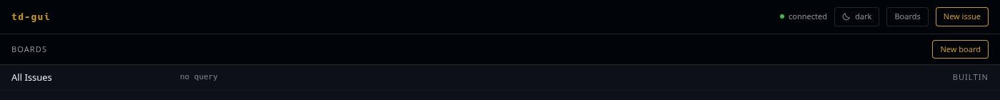
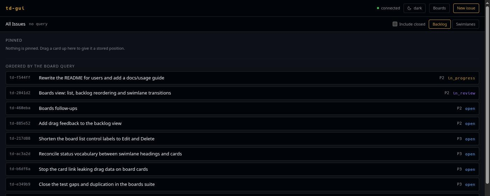
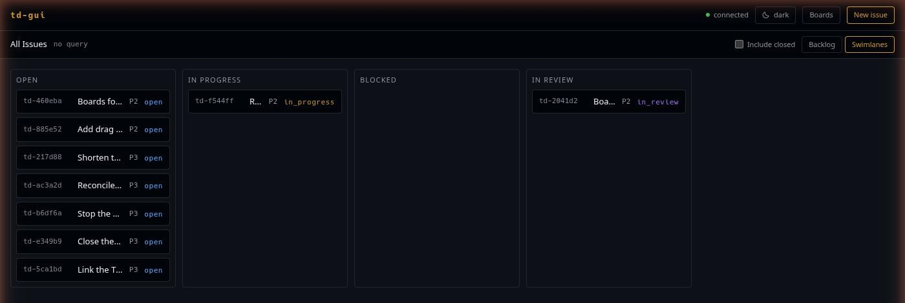

# Boards

A board is a saved query. It does not own issues, it selects them — which is
why the same issue can sit on several boards, and why closing it makes it
disappear from all of them at once.

## The board list



**Boards** in the header lists every board in the project with its query beside
it. td ships one of its own, marked `BUILTIN` and without Edit or Delete
controls, because it is not yours to change: *All Issues* carries an empty
query but td fills it with the whole project.

**New board** creates one. Deleting asks once and deletes the board only — the
issues it selected are untouched.

## Creating a board

A board needs a name and a TDQ query:

```
priority <= P1 AND type = bug
status = in_progress OR status = in_review
assignee = @me AND created >= -7d
```

Nothing here parses TDQ in the browser. td owns the grammar, so a query it
dislikes comes back with td's own explanation under the field.

An empty query is legal, and on a board you create it does not mean
"everything": it means the board shows only the issues positioned on it by
hand. (The builtin *All Issues* is td's own exception to that.)

## Two ways to look at a board

The **Backlog** / **Swimlanes** toggle sits in the board header, next to
**Include closed** — closed issues are filtered out until you ask for them.

Your choice lands in the URL as `?view=`, so a link carries it. It is also
remembered per board in this browser. td's own `view_mode` is the starting
default, and it stays the default: `PATCH /v1/boards/{id}` accepts a name and a
query, nothing else, so there is no way to write the preference back.

### Backlog — one ordered list



td stores one position sequence per board, and cards without a position always
sort after every card that has one. The backlog draws that boundary instead of
hiding it:

- **Pinned** — cards with a stored position. This order is yours and it sticks.
- **Ordered by the board query** — everything else, in whatever order the query
  returned. Nothing in this block can be reordered, because there is no
  position to change.

Drag a card into the pinned block to give it a position; drag between two
pinned cards to place it there. For a card that is already pinned, **↑** and
**↓** do the same job from the keyboard, and **Unpin** removes the stored
position and drops it back into the query-ordered block.

Nothing moves optimistically. td computes the sort key and may respace the
whole board while it does, so the list updates when td answers, not before —
and while a move is in flight the controls are disabled rather than guessing at
a target that is about to shift.

### Swimlanes — columns by status



The same cards, in status columns: open, in progress, blocked, in review, and
closed when you have included it.

Dragging a card to another column **proposes a status change**. A panel opens
with the transitions td allows for that issue, so the drop is a shortcut to the
question, never an answer to it — the actual transition is the one you confirm,
with a reason where td records one. See
[Transitions and reviews](reviews.md).

There is no reordering inside a column, and that is deliberate: td stores one
position sequence for the whole board, so an order written inside a column
would also reorder those cards against every card in every other column.
Ordering belongs to the backlog view, transitions belong here.

## Where the GUI stops

Positions can be edited on a board but not created from outside one: there is
no drag source anywhere else in the UI, so putting the first card on a
query-less board still means `td board move` on the command line. The empty
state says so.
