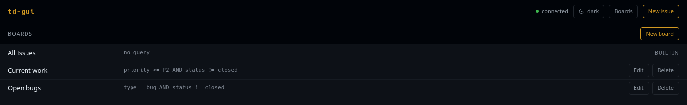
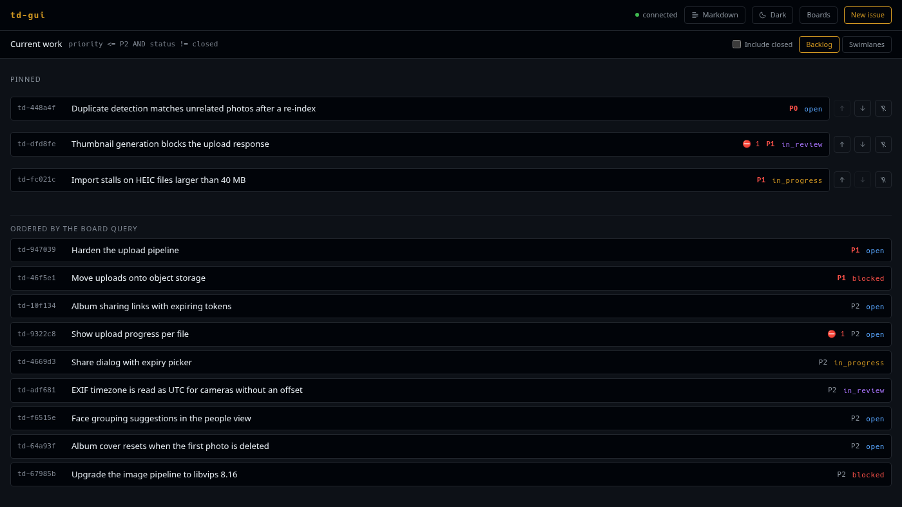
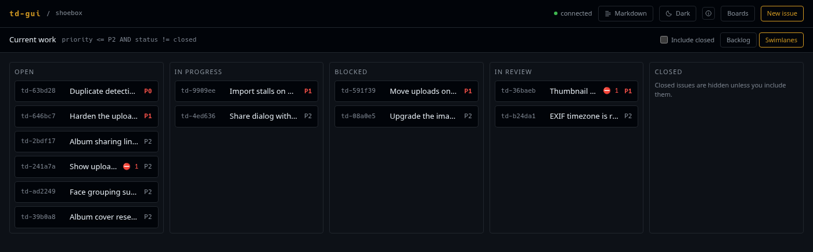

# Boards

A board is a saved query. It does not own issues, it only selects them. That is
why the same issue can sit on several boards, and why closing it makes it
disappear from all of them at once.

## The board list



**Boards** in the header lists every board in the project, with its query beside
it. td ships one board of its own. It is marked `BUILTIN` and has no Edit or
Delete controls, because it is not yours to change: *All Issues* carries an
empty query, and td fills it with the whole project.

**New board** creates one. Deleting a board asks once and removes only the
board itself; the issues it selected are untouched.

## Creating a board

A board needs a name and a TDQ query:

```
priority <= P1 AND type = bug
status = in_progress OR status = in_review
assignee = @me AND created >= -7d
```

Nothing in the browser parses TDQ. td owns the grammar, so a query it dislikes
comes back with td's own explanation under the field.

An empty query is legal. On a board you create yourself it does not mean
"everything": it means the board shows only the issues you place on it by hand.
The builtin *All Issues* board is td's own exception to that rule.

## Two ways to look at a board

The **Backlog** / **Swimlanes** toggle sits in the board header, next to
**Include closed**. Closed issues are filtered out until you ask for them.

Your choice lands in the URL as `?view=`, so a link carries it along. It is
also remembered per board in this browser. td's own `view_mode` provides the
starting default, and it stays the default: `PATCH /v1/boards/{id}` accepts a
name and a query and nothing else, so there is no way to write the preference
back.

### Backlog: one ordered list



td stores one position sequence per board, and cards without a position always
sort behind every card that has one. The backlog view draws that boundary
instead of hiding it:

- **Pinned**: cards with a stored position. This order is yours, and it sticks.
- **Ordered by the board query**: everything else, in whatever order the query
  returned. Nothing in this block can be reordered, because these cards have no
  position to change.

Drag a card into the pinned block to give it a position. Where you let go
decides where it lands: the strip between two pinned cards places it exactly
there, and anywhere else in the block (the **Pinned** heading, or the space
around the list) appends it to the end. When nothing is pinned yet, the whole
block is that one target, which is what the sentence in the empty block is
telling you.

The pinned cards themselves take no drop. Dropping a card back onto a card is
the gesture for calling a drag off, so nothing happens rather than td-gui
guessing at a slot the drop did not name. For a card that is already pinned,
**↑** and **↓** do the same job from the keyboard, and **Unpin** removes the
stored position and drops the card back into the query-ordered block.

Nothing moves optimistically. td computes the sort key, and it may respace the
whole board while doing so, so the list updates when td answers and not before.
While a move is in flight, the controls are disabled rather than pointing at a
target that is about to shift.

### Swimlanes: columns by status



The same cards, arranged in status columns: open, in progress, blocked, in
review, and closed once you have included it.

Dragging a card into another column **proposes a status change**. A panel opens
with the transitions td allows for that issue, so the drop is a shortcut to the
question, never an answer to it. The transition that actually happens is the
one you confirm, with a reason wherever td records one. See
[Transitions and reviews](reviews.md).

You cannot reorder cards inside a column, and that is deliberate: td stores a
single position sequence for the whole board, so an order written inside one
column would also reorder those cards against every card in every other column.
Ordering belongs to the backlog view; transitions belong here.

## Where the GUI stops

Positions can be edited on a board, but they cannot be created from outside
one. There is no drag source anywhere else in the UI, so putting the first card
on a board without a query still means running `td board move` on the command
line. The empty state says so.
