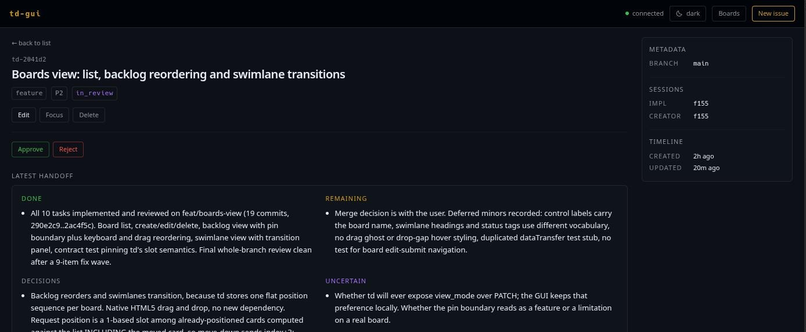
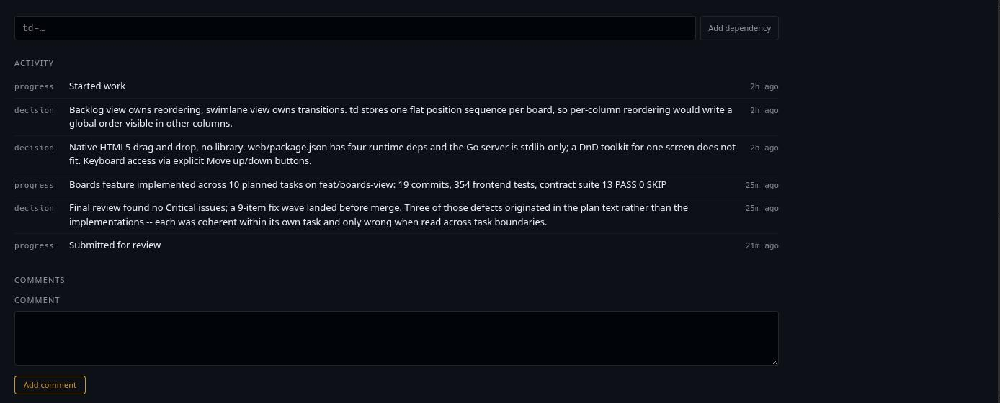
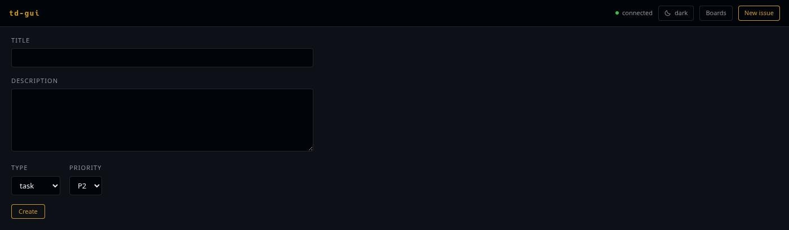
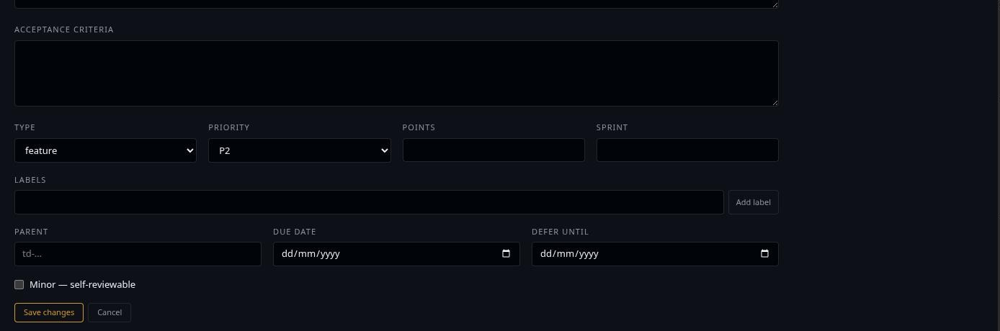

# Working with issues

## The list

The front page is every issue td returns, bucketed by status. The order of the
buckets is attention order, not alphabetical — what is moving comes before what
is not:

`in_progress` → `open` → `in_review` → `blocked` → `closed`

An empty bucket is left out entirely; a status td grows later that td-gui has
never heard of gets its own bucket after the known ones rather than
disappearing. Each heading carries the number of issues under it.

### Sorting

`ID`, `TITLE`, `PRIO` and `UPDATED` are buttons. Click one to sort by it, click
it again to reverse. The arrow shows where the list stands. Sorting happens
inside each status bucket — the grouping is the outer order, which is why
`STATUS` is not sortable.

The list opens on priority ascending, which is the order td itself returns.

Rows that cannot be ordered on the chosen key — an unrecognised priority, an
unparseable timestamp — go last in both directions instead of flipping to the
top.

### Filtering and searching

The search box passes your text to td, which matches it against the issue text.
The five status chips next to it are independent toggles: none active means no
status filter, and several active means "any of these".

Both narrow the same request, so an empty result usually means the filters are
tighter than you meant:

> No issues found.
> Try clearing the status filters, or create the first issue.

One request carries at most 1000 issues — td's own cap. If the project has
more, a note above the list says how many of how many are shown, and the
filters are how you narrow it.

## Reading an issue

Click any row. The detail page shows, top to bottom:

- **The identity** — id, title, then type, priority and status as tags.
- **Edit / Focus / Delete.** Focus is what `td focus` does: it tells td this is
  the issue you are on. It is a one-way message — td exposes no way to read
  focus back — so the button confirms the request and nothing more. Delete is
  td's soft delete and asks once before it goes through.
- **Transitions.** Whatever td reports as available for this issue, and nothing
  when it reports none. See [Transitions and reviews](reviews.md).
- **Description** and **acceptance criteria**, rendered exactly as stored.
  Leading dashes the CLI wrote are the author's text, not a list to re-render.
- **The latest handoff**, split the way td stores it: done, remaining,
  decisions, uncertain. Sections with nothing in them are omitted.
- **Dependencies** — what this issue waits on, with resolved ones separated
  out, plus a box to add another. Under it, **Blocks** (what waits on this) and,
  for an epic, **Tasks** (its direct children). Every one is a link.
- **Activity** — td's log, each entry tagged with its kind (`progress`,
  `decision`, `blocker`, …).
- **Comments** — with a box to add one and a confirm-once delete on each.

The sidebar carries the facts that would interrupt the reading flow: points,
labels, sprint, parent, due and defer dates, the minor flag, the branch the
issue was created on; the implementer, reviewer, creator and closing sessions;
and created / updated / reviewed / closed times. **Rows for unset fields are
not rendered at all** — no dashes, no "unknown". Absence is the answer.

Below it, when a review has been recorded, the review panel shows the standing
decision and hides earlier ones behind a disclosure marked *superseded*.

## Creating an issue

**New issue** in the header opens a form carrying every field td accepts at
creation — title, description, acceptance criteria, type, priority, points,
sprint, labels, parent, due and defer dates, and the minor flag. Submitting
lands you on the issue that was just created.

Nothing is length-checked in the browser. Title bounds are per-project td
config, so td validates and the form shows td's answer under the field it
belongs to:

> title too short (2 chars, min 15)

Every one of those fields goes out in the same POST, so there is no follow-up
edit needed to set them. The one exception is dependencies: `POST /v1/issues`
ignores `depends_on` and `blocks`, so those are added from the detail view
after the issue exists.

## Editing

**Edit** turns the detail page into a form in place: the title stays where you
read it and the rest opens below.

| Field | Notes |
| ----- | ----- |
| Title, description, acceptance criteria | Free text |
| Type, priority | td's own vocabularies |
| Points | Empty clears the estimate |
| Sprint | Free text |
| Labels | Chips plus a free-text add, suggesting labels already used in the project. td does not validate labels, so neither does the form |
| Parent | Type an id or part of a title; the picker searches both |
| Due date, defer until | Date pickers |
| Minor | td's self-reviewable flag |

Only the fields you actually changed are sent. **Cancel** drops the draft;
**Save changes** submits, and any complaint from td appears next to the field
it names.
