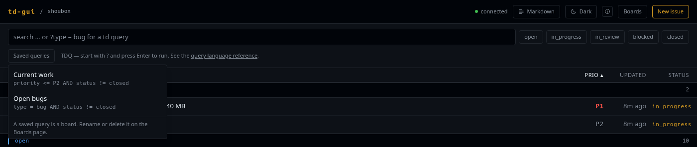

# Working with issues

## The list


The front page shows every issue td returns, grouped by status. The groups are
ordered by how much attention they need rather than alphabetically, so what is
moving comes first and what is finished comes last:

`in_progress` → `open` → `in_review` → `blocked` → `closed`

Empty groups are left out entirely. If td later gains a status that td-gui has
never heard of, that status gets its own group after the known ones instead of
disappearing. Each heading shows how many issues are under it.

### Sorting

`ID`, `TITLE`, `PRIO` and `UPDATED` are buttons. Click one to sort by it, and
click it again to reverse the direction. The arrow shows where the list stands.
Sorting happens inside each status group, because the grouping is the outer
order. That is also why `STATUS` itself is not sortable.

The list opens sorted by priority, ascending, which is the order td itself
returns.

Rows that cannot be sorted on the chosen key, for example one with an
unrecognised priority or an unparseable timestamp, always go last, in both
directions. They never flip to the top.

### Filtering and searching

The search box passes your text to td, which matches it against the issue text.
The five status chips next to it are independent toggles: if none is active,
no status filter is applied, and if several are active, issues matching any of
them are shown.

The ✕ at the right edge of the box empties it in one click, whether it holds
a search or a query, and leaves the cursor there for the next one. The status
chips are a separate control and stay as they are.

Search and filters narrow the same request, so an empty result usually means
the filters are tighter than you meant them to be:

> No issues found.
> Try clearing the status filters, or create the first issue.

A single request carries at most 1000 issues, which is td's own cap. If the
project holds more than that, a note above the list tells you how many of how
many you are seeing, and the filters are how you narrow it down.

### Queries

Full-text search finds text. It cannot express a condition, such as bugs that
are P1 or higher. For that, start the search box with a question mark and the
rest of the line is read as a TDQ query:

```
?type = bug AND priority <= P1
```

TDQ is the same query language boards are built on, and the reference is
linked under the box at all times, whether or not you are writing a query.

A query runs when you press Enter, not while you type. A half-written query is
a syntax error, and there is no point reporting one for a line you are still
writing. If td cannot parse what you pressed Enter on, its own message takes
the place of the list, word for word. Correct the query and press Enter again,
or delete the question mark to go back to searching.

The status chips still work in query mode. The query decides which issues
match, and the chips narrow that answer afterwards, without running the query
again.

Two limits are worth knowing. A query scans at most 10000 issues, which is td's
own default. And the results are matched against the issues the page has
already loaded, so on a project past the 1000-issue cap a query can match an
issue the page does not hold; the note above the list then says how many
results are outside the loaded set rather than dropping them quietly.

To go back to full-text search, delete the question mark. There is no way to
search for text that itself begins with one.

### Saving a query



A query you worked out is worth keeping, and **Saved queries** under the box is
where it goes. It opens a menu of everything the project has saved, and picking
one puts it in the box and runs it straight away.

A saved query is a [board](boards.md). There is no second kind of saved search:
the menu lists the project's boards, and saving one from here creates a board
like **New board** does. That also means the CLI sees it, and so does every
other browser looking at this project.

**Save** appears beside the menu as soon as a query is running, and asks for a
name. td decides whether it likes the name, and says so under the field.

Once a query came from a board, the box remembers which one. Change the query,
press Enter, and the buttons change with it:

- **Update "Sprint 1"** writes the query on screen back to that board. It does
  not ask first — the query is in the box and its results are underneath it.
- **Save as new** keeps the original board as it was and asks for a name for
  the new one.

Renaming and deleting a saved query happen on the Boards page, and so does
placing cards on it by hand.

Two things the menu deliberately leaves out. A board with an empty query is not
listed: on the builtin *All Issues* an empty query means the whole project, on
a board of your own it means only the cards you placed there, and neither of
those is what an empty query would do in the search box. And the status chips
and the sort order are not part of a saved query. A board holds a name and a
query, that is all td stores, so the chips stay yours to turn afterwards.

### The list is in the address bar

What you filtered, searched, queried and sorted for is in the URL:

```
/?q=type+%3D+bug&status=open&sort=updated%3Adesc
```

That is what makes the list survive leaving it. Open an issue and come back,
whether through `← back to list` or the browser's back button, and the list
you left is the list you get. Reload it and nothing is lost. Send the link to
someone else and they see the same list, because the URL says which one it is.
An unfiltered list stays a plain `/`, so nothing is in the address bar that you
did not ask for.

Changing a filter does not add a history entry. The back button takes you to
the page you were on before the list, not through every state the filters have
been in — the search box is debounced, and each pause in typing would
otherwise be its own entry to press back through.

A URL you edited yourself is read as far as it makes sense: a status td does
not have is ignored, and a sort it cannot read falls back to priority
ascending.

## Reading an issue


Click any row to open it. The detail page shows, from top to bottom:

- **The identity**: id and title, followed by type, priority and status as
  tags.
- **Edit, Focus and Delete.** Focus does what `td focus` does: it tells td that
  this is the issue you are working on. td offers no way to read the focus back
  out, so the button can only confirm that the request was sent. Delete is td's
  soft delete, and it asks once before going through.
- **Transitions**: whatever td reports as available for this issue, and nothing
  at all when it reports nothing. See
  [Transitions and reviews](reviews.md).
- **Description** and **acceptance criteria**, rendered as Markdown. A `-`
  list written at the CLI comes out as a list, a fenced block as a code block.
  See [Markdown in long text](#markdown-in-long-text).
- **The latest handoff**, split the way td stores it: done, remaining,
  decisions and uncertain. Sections with nothing in them are left out.
- **Dependencies**: what this issue is waiting for, with the resolved ones
  listed separately, plus a box for adding another. Below that, **Blocks**
  shows what is waiting for this issue, and for an epic, **Tasks** shows its
  direct children. All of them are links.
- **Activity**: td's log, with each entry tagged by its kind (`progress`,
  `decision`, `blocker`, and so on).
- **Comments**, with a box for adding one, and a delete button on each that
  asks once. Comment bodies are Markdown too.


The sidebar carries the facts that would interrupt the reading flow: points,
labels, sprint, parent, due and defer dates, the minor flag, and the branch the
issue was created on; the implementing, reviewing, creating and closing
sessions; and the created, updated, reviewed and closed timestamps. **Fields
that are not set get no row at all**: no dashes, no "unknown". A missing row
means the field is empty.

Below the sidebar, once a review has been recorded, a review panel shows the
standing decision and hides earlier ones behind a disclosure marked
*superseded*.

## Markdown in long text

Issue text is usually written in a terminal, and in practice it is already
Markdown: headings, `-` lists, backticked identifiers, fenced blocks. td-gui
renders it rather than showing you the source characters.

It applies to every long field:

| Field | Where you write it |
| ----- | ------------------ |
| Description | Create and edit forms |
| Acceptance criteria | Create and edit forms |
| Comment body | The box under the comments |
| Review or transition reason | The form a transition opens |

Handoff bullets render the inline parts only, so backticks and links come out
formatted. They are already list items, and a list inside one would read as a
mistake rather than as structure.

The dialect is **GitHub Flavored Markdown**, so tables and strikethrough work
alongside the CommonMark basics. Each of those fields says so under the box,
with a link to the spec.

Two consequences are worth knowing, because they are what surprises people:

**A single newline does not break the line.** Paragraphs are joined and
re-wrapped to the width of the column, which is what you want for text
hard-wrapped at eighty columns in a terminal. Leave a blank line to start a new
paragraph.

**Indent anything whose alignment matters.** Four spaces makes a block literal,
which preserves pasted terminal output exactly. Aligned columns left
unindented are treated as a paragraph and re-wrapped, and the alignment is
lost.

### Switching to the source

The **Markdown** button in the header switches every one of those fields to the
text td actually stored, and back. It is monospace, keeps the line breaks and
indentation you typed, and is there when you want to copy the source out, or to
see what a re-wrapped paragraph or an unindented table looked like before it
was rendered.

The choice is yours and it sticks: it applies to every issue you open and it
survives a reload, until you press the button again. Editing is unaffected, the
forms always hold the raw source.

Wide tables and code blocks scroll inside their own box rather than stretching
the page.

Nothing about the stored text changes. The editor still shows the raw source,
and what you type is what td stores; the rendering happens only when the text
is displayed. Raw HTML is never rendered as markup: a `<script>` tag in a
description is shown as the characters you typed.

## Creating an issue


**New issue** in the header opens a form with every field td accepts when an
issue is created: title, description, acceptance criteria, type, priority,
points, sprint, labels, parent, due and defer dates, and the minor flag. When
you submit, you land on the issue you just created.

The browser checks no lengths of its own. Title limits are part of the
per-project td config, so td validates the input and the form shows td's answer
under the field it belongs to:

> title too short (2 chars, min 15)

All of those fields go out in the same POST, so you never need a follow-up edit
to set them. Dependencies are the one exception: `POST /v1/issues` ignores
`depends_on` and `blocks`, so you add those from the detail view once the issue
exists.

## Editing


**Edit** turns the detail page into a form in place. The title stays where you
were reading it, and the rest of the fields open below it.

| Field | Notes |
| ----- | ----- |
| Status | The five td statuses. Not an ordinary field — see below |
| Title, description, acceptance criteria | Free text. Description and acceptance render as Markdown when displayed; the editor holds the raw source |
| Type, priority | td's own vocabularies |
| Points | Leave it empty to clear the estimate |
| Sprint | Free text |
| Labels | Chips plus a free-text field that suggests labels already used in the project. td does not validate labels, so neither does the form |
| Parent | Type an id or part of a title; the picker searches both |
| Due date, defer until | Date pickers |
| Minor | td's self-reviewable flag |

Only the fields you actually changed are sent. **Cancel** discards the draft,
and **Save changes** submits it. Anything td complains about appears next to
the field it names.

### The status is not an ordinary field

td has no "set the status" operation: a status changes by making one of td's
transitions, and each has its own rules and its own record. So picking a
status here tells the form which transition to run, and it says which one
before you save:

- Picking **closed** on an issue awaiting review runs **Approve**, and asks
  who reviewed it, exactly as the Approve button does.
- Picking **open** on that same issue runs **Reject**, and asks for a reason,
  which td keeps as the review summary.
- Three moves have no transition at all — `in_progress` back to `open`,
  and `in_review` or `blocked` to `in_progress`. td-gui runs td's CLI for
  those, and asks you to confirm first, because they record less: only the
  revert to `open` leaves an entry in the session log.

Some combinations td simply refuses, `closed` to `blocked` among them. They
are offered anyway rather than greyed out, and td answers in its own words:
`invalid transition from closed to blocked`.

Because the status is a separate operation, a save that changes both the
fields and the status is two requests. The fields go first. If td then refuses
the status change, the form says so precisely — *Fields saved. Status change
refused* — keeps your choice, and stays open so you can retry it or set it
back. See [Transitions and reviews](reviews.md).
