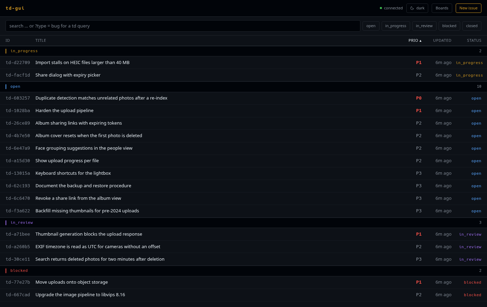
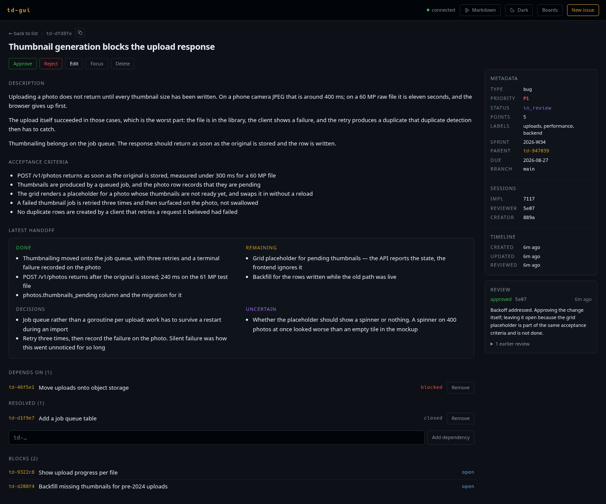
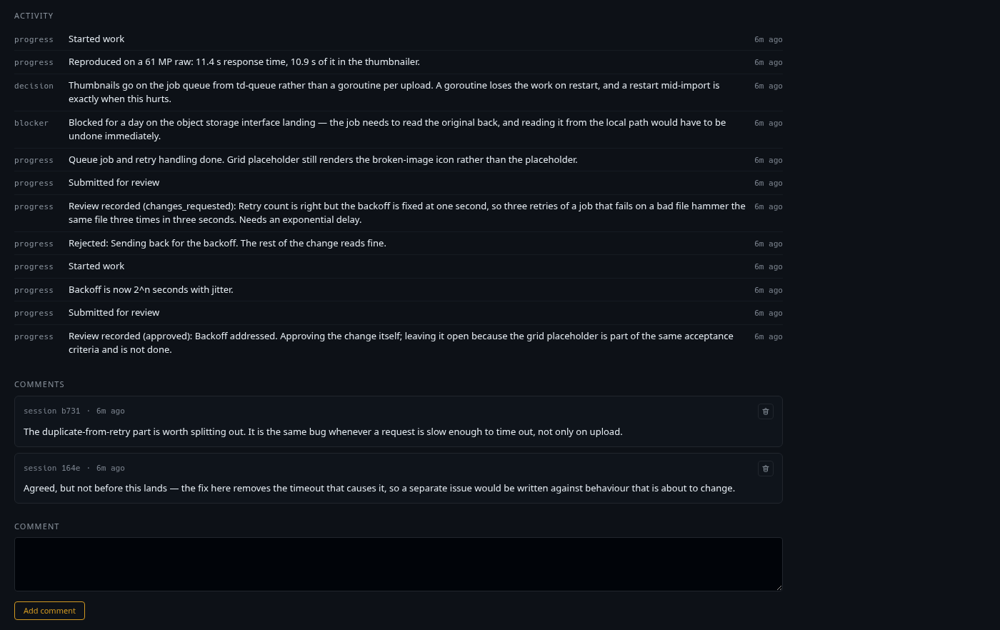
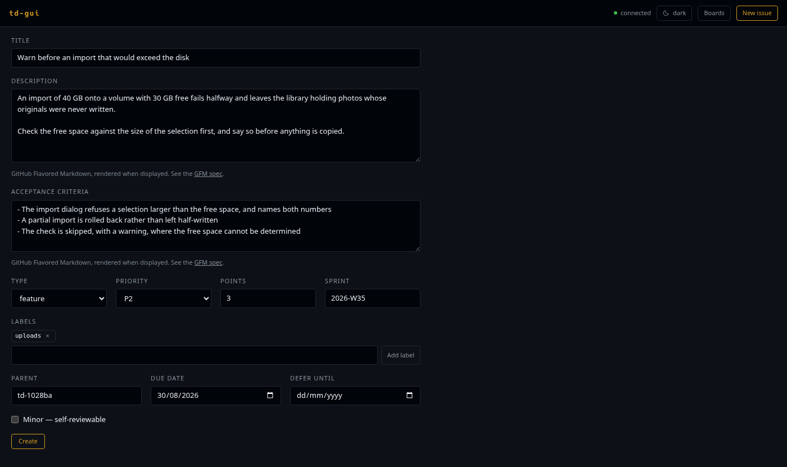
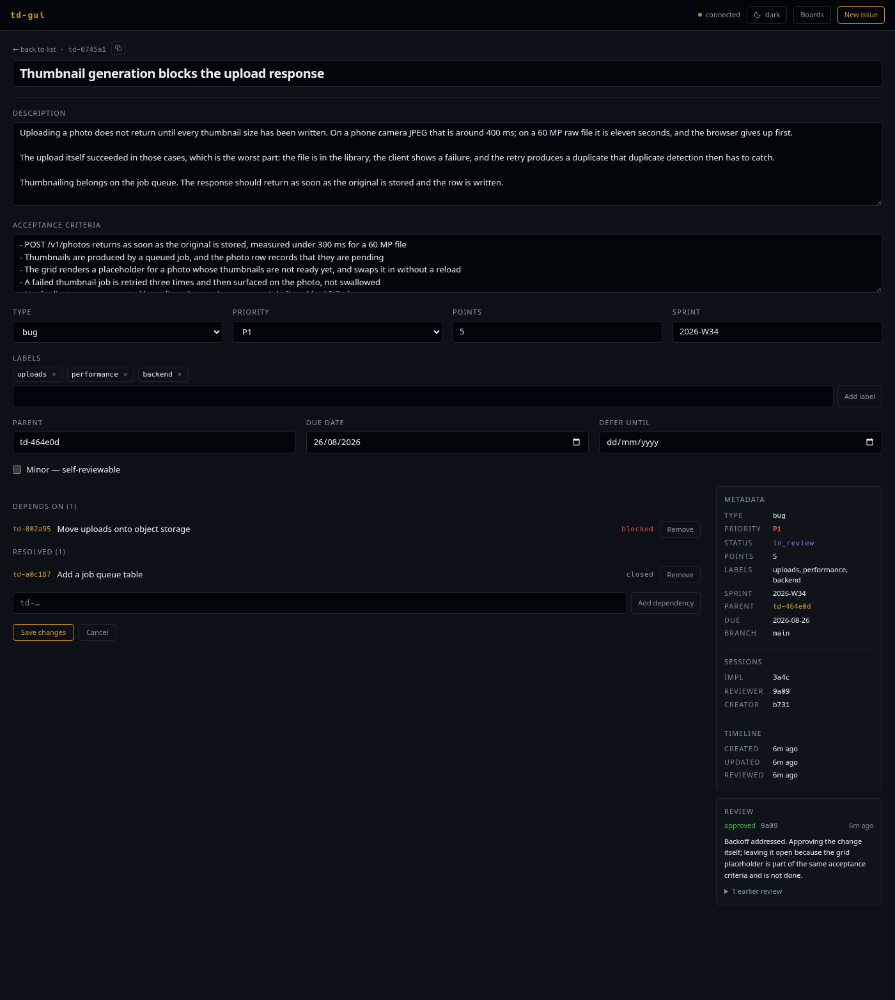

# Working with issues

## The list

The front page shows every issue td returns, grouped by status. The groups are
ordered by how much attention they need rather than alphabetically, so what is
moving comes first and what is finished comes last:

`in_progress` → `open` → `in_review` → `blocked` → `closed`

Empty groups are left out entirely. If td later gains a status that td-gui has
never heard of, that status gets its own group after the known ones instead of
disappearing. Each heading shows how many issues are under it.

### Sorting

`ID`, `TITLE`, `PRIO` and `UPDATED` are buttons. Click one to sort by it, and
click it again to reverse the direction. The arrow shows where the list stands.
Sorting happens inside each status group, because the grouping is the outer
order. That is also why `STATUS` itself is not sortable.

The list opens sorted by priority, ascending, which is the order td itself
returns.

Rows that cannot be sorted on the chosen key, for example one with an
unrecognised priority or an unparseable timestamp, always go last, in both
directions. They never flip to the top.

### Filtering and searching

The search box passes your text to td, which matches it against the issue text.
The five status chips next to it are independent toggles: if none is active,
no status filter is applied, and if several are active, issues matching any of
them are shown.

Search and filters narrow the same request, so an empty result usually means
the filters are tighter than you meant them to be:

> No issues found.
> Try clearing the status filters, or create the first issue.

A single request carries at most 1000 issues, which is td's own cap. If the
project holds more than that, a note above the list tells you how many of how
many you are seeing, and the filters are how you narrow it down.

## Reading an issue

Click any row to open it. The detail page shows, from top to bottom:

- **The identity**: id and title, followed by type, priority and status as
  tags.
- **Edit, Focus and Delete.** Focus does what `td focus` does: it tells td that
  this is the issue you are working on. td offers no way to read the focus back
  out, so the button can only confirm that the request was sent. Delete is td's
  soft delete, and it asks once before going through.
- **Transitions**: whatever td reports as available for this issue, and nothing
  at all when it reports nothing. See
  [Transitions and reviews](reviews.md).
- **Description** and **acceptance criteria**, shown exactly as they are
  stored. Leading dashes that the CLI wrote are part of the author's text, not
  a list to be re-rendered.
- **The latest handoff**, split the way td stores it: done, remaining,
  decisions and uncertain. Sections with nothing in them are left out.
- **Dependencies**: what this issue is waiting for, with the resolved ones
  listed separately, plus a box for adding another. Below that, **Blocks**
  shows what is waiting for this issue, and for an epic, **Tasks** shows its
  direct children. All of them are links.
- **Activity**: td's log, with each entry tagged by its kind (`progress`,
  `decision`, `blocker`, and so on).
- **Comments**, with a box for adding one, and a delete button on each that
  asks once.

The sidebar carries the facts that would interrupt the reading flow: points,
labels, sprint, parent, due and defer dates, the minor flag, and the branch the
issue was created on; the implementing, reviewing, creating and closing
sessions; and the created, updated, reviewed and closed timestamps. **Fields
that are not set get no row at all**: no dashes, no "unknown". A missing row
means the field is empty.

Below the sidebar, once a review has been recorded, a review panel shows the
standing decision and hides earlier ones behind a disclosure marked
*superseded*.

## Creating an issue

**New issue** in the header opens a form with every field td accepts when an
issue is created: title, description, acceptance criteria, type, priority,
points, sprint, labels, parent, due and defer dates, and the minor flag. When
you submit, you land on the issue you just created.

The browser checks no lengths of its own. Title limits are part of the
per-project td config, so td validates the input and the form shows td's answer
under the field it belongs to:

> title too short (2 chars, min 15)

All of those fields go out in the same POST, so you never need a follow-up edit
to set them. Dependencies are the one exception: `POST /v1/issues` ignores
`depends_on` and `blocks`, so you add those from the detail view once the issue
exists.

## Editing

**Edit** turns the detail page into a form in place. The title stays where you
were reading it, and the rest of the fields open below it.

| Field | Notes |
| ----- | ----- |
| Title, description, acceptance criteria | Free text |
| Type, priority | td's own vocabularies |
| Points | Leave it empty to clear the estimate |
| Sprint | Free text |
| Labels | Chips plus a free-text field that suggests labels already used in the project. td does not validate labels, so neither does the form |
| Parent | Type an id or part of a title; the picker searches both |
| Due date, defer until | Date pickers |
| Minor | td's self-reviewable flag |

Only the fields you actually changed are sent. **Cancel** discards the draft,
and **Save changes** submits it. Anything td complains about appears next to
the field it names.
