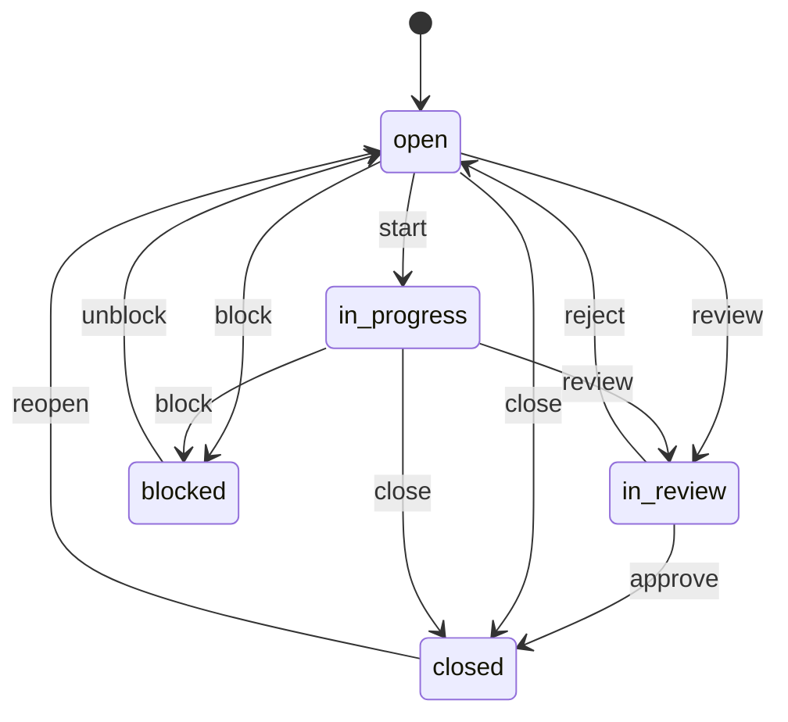

# Transitions and reviews

## The flow

td moves an issue through a small set of statuses:

td-gui does not model any of this itself. It renders the buttons td reports as
available for that issue at that moment, labelled in plain English (`start`
becomes **Start**, `review` becomes **Request review**), and it renders nothing
at all when td reports nothing. That is also the answer to "why is there no
Approve button here": td did not offer one.

Here is what that looks like in practice, as td v0.57 reports it:

| The issue is | You are offered |
| ------------ | --------------- |
| `open` | Start, Request review, Block, Close |
| `in_progress` | Request review, Block, Close |
| `in_review` | Approve, Reject |

Read that as an illustration, not a contract. The real list is td's answer for
each individual issue, and it can differ: for a minor issue, under a different
review policy, or with a future version of td. The UI follows whatever td says,
without needing a change here.

## Reasons

Four transitions open a small form instead of firing immediately: **Reject**,
**Block**, **Close** and **Approve**.

For reject, block and close, td appends the text you type as a progress log
entry, exactly the way `td reject --reason` does. The text is optional, but it
is worth writing anyway, because it is what the next session will read.

The text is Markdown, the same as a description or a comment, so a rejection
that needs a list of what is missing can be written as one. See
[Markdown in long text](issues.md#markdown-in-long-text).

**Cancel** closes the form and changes nothing. Clicking a different transition
also discards what you typed.

## Approving

td's default review policy is *trusted mode*: closing an issue needs a review,
and td wants to know who performed it. That is why approving asks you first.

| Choice | What td records |
| ------ | --------------- |
| **I reviewed this independently** | An ordinary approval by this session |
| **Reviewed by someone else** | The name you enter, as td's `reviewed_by` |
| **I reviewed my own work** | td's `self_review` flag, which is then visibly marked on the issue |

The three options are a radio group because td treats them as mutually
exclusive: sending an attributed review and a self-review together is a 400,
and a radio group makes that combination unreachable in the first place.

**Record only, do not close** attests to the review without moving the issue.
That helps when the reviewer is not the person who should close it. td requires
a summary in this case, and says so itself if you leave it empty.

## When td refuses

Session isolation is real, and td enforces it, not the UI. If you try to
approve your own work as some other kind of review, you get:

> you implemented this issue, so you cannot approve it

That message, and every other validation or policy error, is shown exactly as
td phrased it, under a heading naming what was rejected. td-gui never
paraphrases it: td knows why it refused, and a generic "not allowed" would
throw that away.

## Reading the review afterwards

Once a review exists, a **Review** panel appears in the sidebar. It shows the
standing decision, the reviewer's session, when it happened, the summary, and a
`self-reviewed` marker where that applies.

If the issue has been through review before, for example rejected, reworked and
then approved, the earlier entries sit behind a disclosure and are marked
*superseded*. That history arrives together with the issue, so opening it costs
no extra request.
