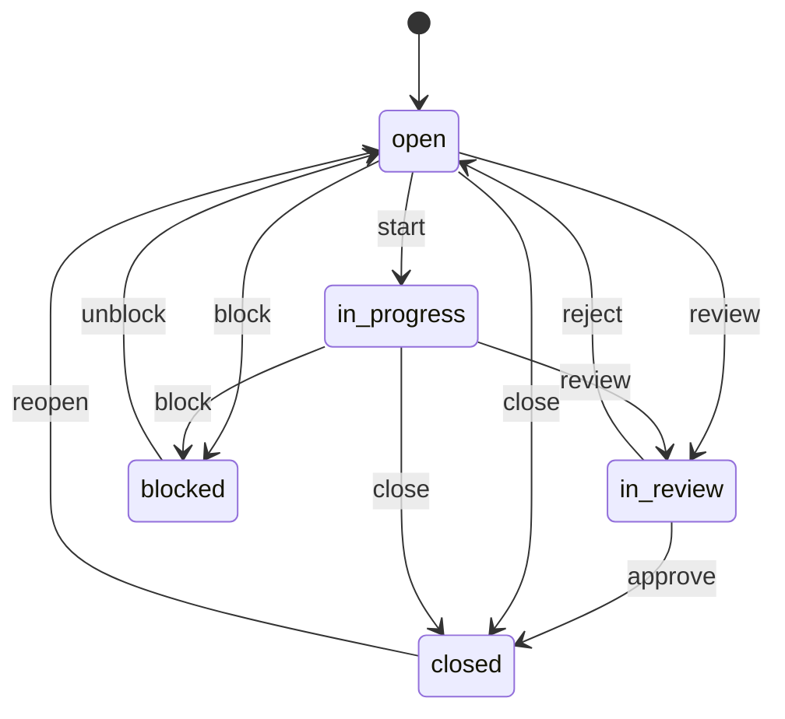
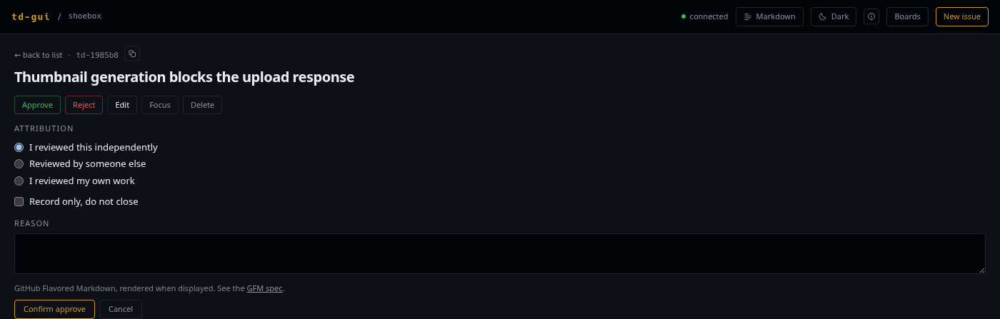

# Transitions and reviews

## The flow

td moves an issue through a small set of statuses:

td-gui does not model any of this. It renders the buttons td reports as
available for that issue at that moment, labelled in plain English (`start`
becomes **Start**, `review` becomes **Request review**), and renders nothing at
all when td reports nothing. Which is also the answer to "why is there no
Approve button here": td did not offer one.

What that looks like in practice, as td v0.57 reports it:

| The issue is | You are offered |
| ------------ | --------------- |
| `open` | Start, Request review, Block, Close |
| `in_progress` | Request review, Block, Close |
| `in_review` | Approve, Reject |

Read that as an illustration, not a contract. The list is td's answer per
issue, and it can differ (a minor issue, a different review policy, a future
td), and the UI will follow without a change here.

## Reasons

Four transitions open a small form instead of firing immediately:
**Reject**, **Block**, **Close** and **Approve**.

For reject, block and close, the text you type is appended by td as a progress
log entry, the same thing `td reject --reason` does. It is optional, and
worth writing anyway: it is what the next session reads.

**Cancel** closes the form and changes nothing. Walking away by clicking a
different transition also discards it.

## Approving

td's default review policy is *trusted mode*: closing an issue needs a review,
and td wants to know who performed it. So approving asks first.

| Choice | What td records |
| ------ | --------------- |
| **I reviewed this independently** | An ordinary approval by this session |
| **Reviewed by someone else** | The name you enter, as td's `reviewed_by` |
| **I reviewed my own work** | td's `self_review` flag, visibly marked as such on the issue afterwards |

The three are a radio group because they are mutually exclusive in td: sending
an attributed review *and* a self-review together is a 400, and a radio group
makes that state unreachable.

**Record only, do not close** attests to the review without moving the issue.
That is useful when the reviewer is not the one who should close it. td
requires a summary for this, and says so itself if you leave it empty.

## When td refuses

Session isolation is real and enforced by td, not by the UI. Approving your own
work as a different kind of review gets you:

> you implemented this issue, so you cannot approve it

That message, and every other validation or policy error, is shown exactly as
td phrased it, under a heading naming what was rejected. td-gui never
paraphrases it: td knows why it refused, and a generic "not allowed" would
throw that away.

## Reading the review afterwards

Once a review exists, a **Review** panel appears in the sidebar with the
standing decision, the reviewer's session, when it happened, the summary, and a
`self-reviewed` marker where that applies.

If the issue has been through review before (rejected, reworked, approved),
the earlier entries sit behind a disclosure and are marked *superseded*. The
history arrives with the issue, so opening it costs no request.
